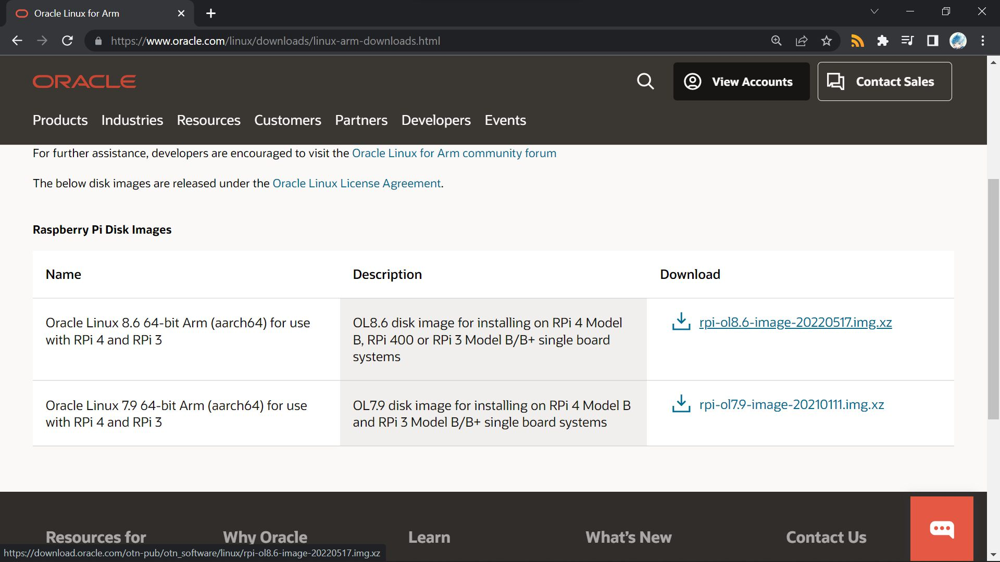

# pi-rhel
How To: Install Red Hat Enterprise Linux on Raspberry Pi

---

Seems like a compensation for [the killing of CentOS](https://the-report.cloud/ibms-red-hat-just-killed-centos-as-we-know-it-with-centos-stream-stability-goes-out-of-the-door),
Red Hat announced a [no-cost RHEL individual subscription](https://developers.redhat.com/articles/faqs-no-cost-red-hat-enterprise-linux).
That is to say, you can run genuine RHEL, legally, for free.

Whoa, sounds like a better choice than CentOS, right?

But I don't have a physical machine to try it out, except for a Raspberry Pi 4B.
Then I wonder, how could I do that?

I started by searching for a tutorial, but Bing gives a rather annoying assertion.

Just a second before I was about to give up,
I surprisingly found that [Oracle Linux](https://www.oracle.com/linux),
an RHEL derivatives distributed by Oracle
~~who blocked me 100+ times for registering their cloud service~~,
releases [prebuilt image for Raspberry Pi 4B, 400 and 3B/+](https://www.oracle.com/linux/downloads/linux-arm-downloads.html).

That's the only distro that supports Pi as far as I know.

Luckily after a few days of effort,
I managed to find a way to install RHEL use it as a springboard.
The instructions are as follows.

# Prerequisite

* A Raspberry Pi 4B, 400 or 3B/+
  * Only tested on 4B
* A system drive
  * Note: SSD via USB is highly recommended against SD card
* Red Hat Individual Subscription
* Internet connection

# Registering for Red Hat Individual Subscription

# Installing Oracle Linux

# Patching and Running `convert2rhel`

# Registering the System

# Replacing Repositories of Packages

# FAQ
