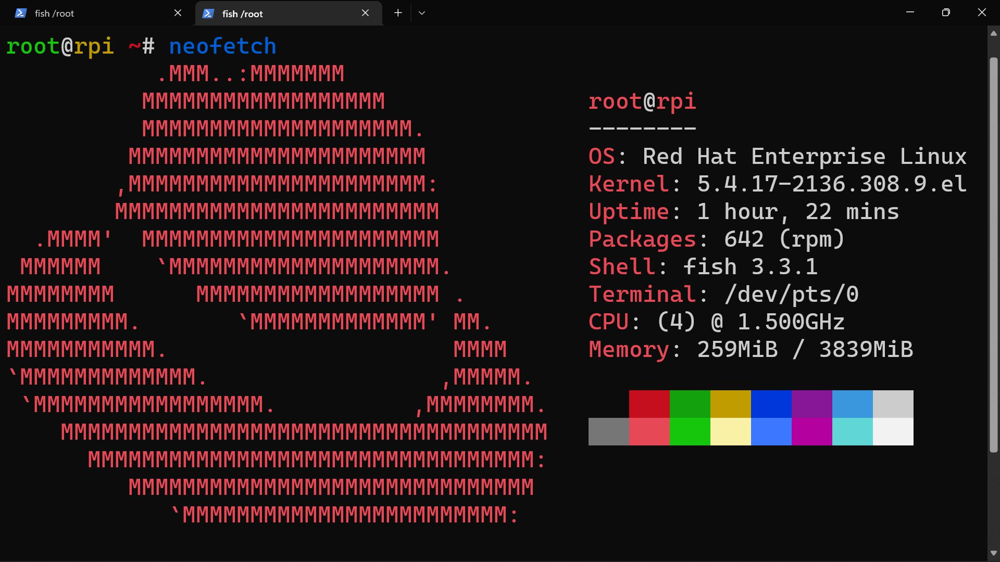
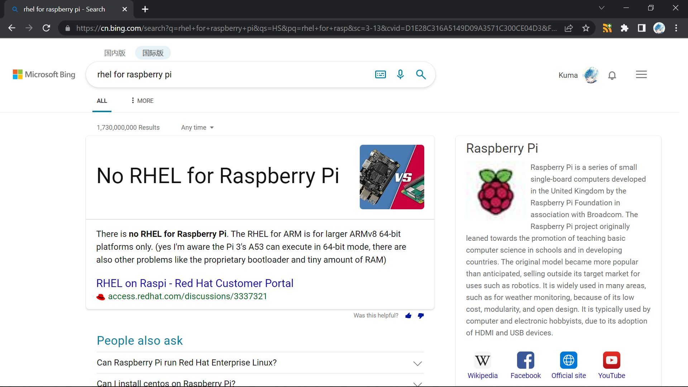

# pi-rhel
RHEL for Pi: Install Red Hat Enterprise Linux on Raspberry Pi

---

Seems like a compensation for [the killing of CentOS](https://the-report.cloud/ibms-red-hat-just-killed-centos-as-we-know-it-with-centos-stream-stability-goes-out-of-the-door),
Red Hat announced a [no-cost RHEL individual subscription](https://developers.redhat.com/articles/faqs-no-cost-red-hat-enterprise-linux).

That is to say, you can run genuine RHEL, legally, for free.

Whoa, sounds like a better choice than CentOS, right?

But I don't have a physical machine to try it out, except for a Raspberry Pi 4B.
Then I wonder, how could I do that?

I started by searching for a tutorial, but Bing gives a rather annoying assertion.

---

# WIP!!!

---

# Fundamentals

# Prerequisite

# Installing Oracle Linux

# Patching and Running `convert2rhel`

# Registering the System

# Replacing Repositories of Packages

# FAQ
