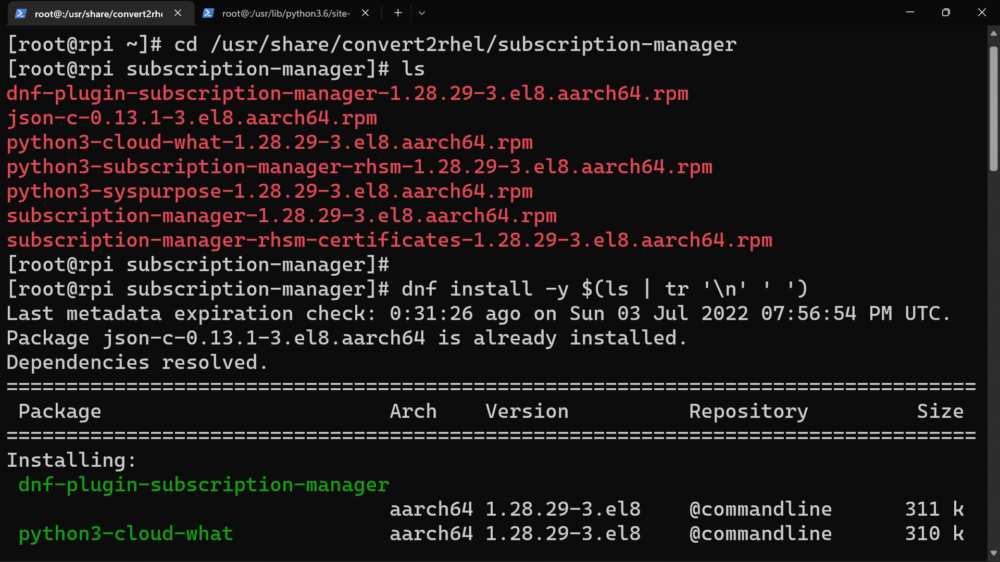

# pi-rhel
How To: Install Red Hat Enterprise Linux on Raspberry Pi


---

<details>
  <summary>How I come up with this thought...</summary>

Seems like a compensation for [the killing of CentOS](https://the-report.cloud/ibms-red-hat-just-killed-centos-as-we-know-it-with-centos-stream-stability-goes-out-of-the-door),
Red Hat announced a [no-cost RHEL individual subscription](https://developers.redhat.com/articles/faqs-no-cost-red-hat-enterprise-linux).
That is to say, you can run genuine RHEL, legally, for free.

Whoa, sounds like a better choice than CentOS, right?

But I don't have a physical machine to try it out, except for a Raspberry Pi 4B.
Then I wonder, how could I do that?

I started by searching for a tutorial, but Bing gives a rather annoying assertion.


Just a second before I was about to give up,
I surprisingly found that [Oracle Linux](https://www.oracle.com/linux),
an RHEL derivatives distributed by Oracle
~~who blocked me 100+ times for registering their cloud service~~,
releases [prebuilt image for Raspberry Pi 4B, 400 and 3B/+](https://www.oracle.com/linux/downloads/linux-arm-downloads.html).


That's the only distro that supports Pi as far as I know.

Luckily after a few days of effort,
I managed to find a way to install RHEL use it as a springboard.
The instructions are as follows.

</details>

## Prerequisite

* A Raspberry Pi 4B, 400 or 3B/+
  * Only tested on 4B
* A system drive
  * Note: SSD via USB is highly recommended against SD card
* Red Hat Individual Subscription
* Internet connection

## Register for Red Hat Individual Subscription

As mentioned above, [register for Red Hat Individual Subscription](https://developers.redhat.com/register).

After the registration process, you should see the following subscriptions
on [your management page](https://access.redhat.com/management/subscriptions):


Registration is necessary since we need to update packages from RHEL's repositories.

## Install Oracle Linux

[Download Oracle Linux](https://www.oracle.com/linux/downloads/linux-arm-downloads.html) first.

Then, find a flashing tool you like.
Generally, [Raspberry Pi Imager](https://www.raspberrypi.com/software/#:~:text=Pi%20OS%20using-,Raspberry%C2%A0Pi%C2%A0Imager,-Raspberry%20Pi%20Imager)
is a good choice, but I personally prefer [Etcher](https://etcher.io).

The downloaded image has been compressed in `xz` format. You don't need to decompress the file, the tool will handle it.


<details>
  <summary>You probably need an SSD...</summary>

### SSD vs SD Card

Oracle Linux comes with `btrfs` for its root filesystem, which is horribly slow for SD card and USB drive.

`btrfs` has ruined a total of 5 SDs and USB drives, just for this tutorial.
So I'd recommend use a SSD if you could.

As for SD cards, `f2fs` should be a much better choice, if possible.

</details>

Plug in your system drive, and boot the pi.
Then go to your router's DHCP clients page, find the IP address of your Pi.


`ssh` to your Pi using username `root` and password `oracle`.
You will be asked to change the password immediately.


## Prepare the system

### Expand the root filesystem

The decompressed prebuilt image is about 3.89 GB. After installation, you will be left with about 300 MB.
That's not enough for any of the following operations, so we need to extend the system partition.

We will use `parted` to do that.

First, install it:

```shell
dnf install -y parted
```

> Note: you do not need to run `dnf update` like you do on Debian/Ubuntu.
> RPM will retrieve the latest package indexes before any installation.
> 
> `dnf update` is more equivalent to `apt update && apt upgrade`.


Then, expand the root filesystem:

```shell
parted /dev/sda

# print
# resizepart 3
# q
```


And don't forget to inform `btrfs` of the changes:

```shell
btrfs filesystem resize max /
```

### Update `kernel-uek`

The one and only package we are going to reserve is `kernel-uek`.
`kernel-uek`, short for [Unbreakable Enterprise Kernel](https://docs.oracle.com/en/operating-systems/uek/),
is a Linux kernel built by Oracle (more details link above).
Since Oracle Linux is the only distro that supports Pi,
its kernel is consequently the only one that does it.

```shell
dnf update -y kernel-uek
```


## Patch and Run `convert2rhel`

<details>
  <summary>Current OS...</summary>

Before we start our process of converting to RHEL,
let's have a look at the `os-release`:

```shell
cat /etc/os-release
```


It's still `Oracle Linux` apparently.

</details>

### Install `convert2rhel`

Referring to [Red Hat's conversion guide](https://www.redhat.com/en/blog/introduction-convert2rhel-now-officially-supported-convert-rhel-systems-rhel),
we will start by adding custom certs and repos:

```shell
# ref: https://www.redhat.com/en/blog/introduction-convert2rhel-now-officially-supported-convert-rhel-systems-rhel

curl -o /etc/pki/rpm-gpg/RPM-GPG-KEY-redhat-release https://www.redhat.com/security/data/fd431d51.txt
curl --create-dirs -o /etc/rhsm/ca/redhat-uep.pem https://ftp.redhat.com/redhat/convert2rhel/redhat-uep.pem
curl -o /etc/yum.repos.d/convert2rhel.repo https://ftp.redhat.com/redhat/convert2rhel/8/convert2rhel.repo
```

Then we can install the `convert2rhel` package:

```shell
dnf install -y convert2rhel
```


### Modify Config

Now it's the key point.
Since RHEL doesn't officially support Raspberry Pi,
it's conversion tool won't contain its configurations either.


Luckily, we don't need to manually configure it,
just modify the config for `x86_64` is ok:

```shell
cp /usr/share/convert2rhel/configs/oracle-8-x86_64.cfg /usr/share/convert2rhel/configs/oracle-8-aarch64.cfg
sed -i 's/rhel-8-for-x86_64/rhel-8-for-aarch64/g' /usr/share/convert2rhel/configs/oracle-8-aarch64.cfg
# sed -i 's/-rpms/-beta-rpms/g' /usr/share/convert2rhel/configs/oracle-8-aarch64.cfg
# sed -i "s/checks.perform_pre_checks()/loggerinst.task('SKIP CHECKS')  # checks.perform_pre_checks()/g" /usr/lib/python3.6/site-packages/convert2rhel/main.py
sed -i 's/json-c.x86_64/json-c.aarch64/g' /usr/lib/python3.6/site-packages/convert2rhel/subscription.py
```

If you are on `x86_64`, `convert2rhel` will handle the certs you need.
But on the Pi, we need to manually download from Red Hat's website:

[**Red Hat Product Certificates**](https://access.redhat.com/labs/rhpc/)


Select `Red Hat Enterprise Linux Server` in _Choose your product_,
find **`Red Hat Enterprise Linux for ARM 64`**,
select version and architecture, and download the cert.

Copy the cert to the pi and run it:

```shell
# cp /path/to/cert/script /tmp/Red_Hat_Product_Certificate.sh
chmod +x /tmp/Red_Hat_Product_Certificate.sh
bash /tmp/Red_Hat_Product_Certificate.sh
```


### Manually Run `convert2rhel`

We still can't run `convert2rhel` directly,
all because it's not designed to be run on a Pi.

Instead, run the following code:

```shell
source /etc/os-release && python3 -c "from convert2rhel import main, subscription, systeminfo; main.initialize_logger('convert2rhel.log', '/var/log/convert2rhel'); systeminfo.RELEASE_VER_MAPPING['$VERSION'] = '$VERSION'; systeminfo.system_info.resolve_system_info(); subscription.download_rhsm_pkgs()"
```

Alternatively, if you prefer to run interactively in Python:

```python
from convert2rhel import main, subscription, systeminfo  # noqa


def convert():
    main.initialize_logger('convert2rhel.log', '/var/log/convert2rhel')
    systeminfo.RELEASE_VER_MAPPING['$VERSION'] = input('Enter the RHEL version: ') or '8.6'
    systeminfo.system_info.resolve_system_info()
    subscription.download_rhsm_pkgs()


if __name__ == '__main__':
    convert()
```

If run correctly, you should see the following output:


Then we are about to install the packages we just downloaded:

```shell
cd /usr/share/convert2rhel/subscription-manager
dnf install -y $(ls | tr '\n' ' ')
```



## Register the System

We just installed RHEL's subscription manager,
and it's time to register the system using the account we just created.

```shell
subscription-manager register
```

If success, you can check your available subscriptions:

```shell
subscription-manager list --available
```

## Replace Repositories of Packages

Basically you are all done after the last step.
But to make a _pure_ RHEL, it's better to replace the packages installed
from Oracle Linux with the ones from RHEL.

First let's disable the deprecated repositories:

```shell
mv /etc/yum.repos.d/convert2rhel.repo /etc/yum.repos.d/convert2rhel.repo.bak
mv /etc/yum.repos.d/oracle-linux-ol8.repo /etc/yum.repos.d/oracle-linux-ol8.repo.bak
dnf clean all
```


Note that from now everytime you run `dnf` or `yum`,
you'll see `Updating Subscription Management repositories`.
That's the _certification_ of a genuine RHEL with legal subscription.

If you start to install packages, you could see it's syncing from RHEL's indexes!

### Remove Unneeded Packages

```shell
dnf install https://dl.fedoraproject.org/pub/epel/epel-release-latest-8.noarch.rpm
subscription-manager repos --enable "codeready-builder-for-rhel-8-$(arch)-rpms"
dnf remove convert2rhel -y
dnf remove oraclelinux-release oraclelinux-release-el8 || rpm -e --nodeps oraclelinux-release oraclelinux-release-el8
```

### Reinstall Local-installed Packages

```shell
cd /usr/share/convert2rhel/subscription-manager
dnf reinstall -y $(ls | tr '\n' ' ' | sed 's/.rpm//g')
cd ~
rm -rvf /usr/share/convert2rhel
```


### Replace Non-RHEL Packages

First install `redhat-lsb`:

```shell
dnf install -y redhat-lsb
```


Then:

```shell
dnf reinstall setup
dnf distro-sync
dnf update -y
dnf reinstall $(dnf list --installed | grep ol8 | awk '{print $1}' | tr '\n' ' ')
dnf reinstall $(dnf list --installed | grep anaconda | awk '{print $1}' | tr '\n' ' ')
dnf reinstall $(dnf list --installed | grep commandline | awk '{print $1}' | tr '\n' ' ')
```


## Conclusion

Don't forget to check `neofetch`!


You have just registered your system to RHEL's network.
You can check it on [the subscription management page](https://access.redhat.com/management/subscriptions).
Select `Systems` in the tab bar.


By clicking into it, you can examine the details of your system,
including potential vulnerabilities.


## FAQs

### How about RHEL 9?

RHEL 9 has released this May.
However, our system has not prepared for upgrading it through
[official methods](https://access.redhat.com/documentation/en-us/red_hat_enterprise_linux/9/html/upgrading_from_rhel_8_to_rhel_9/index) yet:


By the time you read this, Oracle Linux has just released OL9 for the Pi too,
but `convert2rhel` has not.
Maybe we should wait for a few more days, and approach in a similar way.
